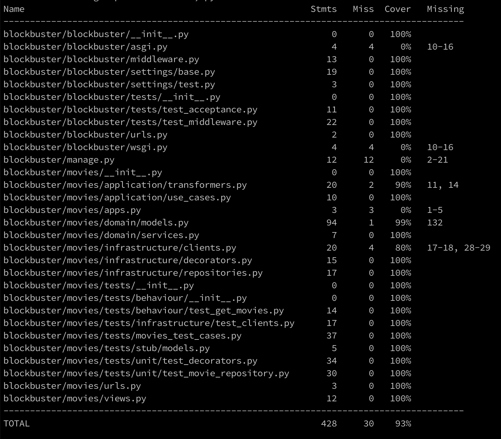

# Blockbuster

[](https://travis-ci.org/mrjusti/blockbuster)

API that connect with **Studio Ghibli** and return a list of all their movies with all the people that appear in each.


## Technologies

The application use **django** for the framework but it is made with **Hexagonal Architecture** so it is anecdotal which framework use for the domain logic. You can find all the **Application**, **Domain** and **Infrastructure** inside the folder ```blockbuster/movies``` from the ```root``` folder.

You will see that all the test for the package `blockbuster.movies` are separated as `behaviour`, `infrastructure` and `unit` modules.

In the `blockbuster.blockbuster` package you can find more `tests`, this is because I create a django middleware for a pretty response in case that something goes wrong and raise an exception and for the `acceptance` test too because I use the django's client.

## Entry Point

The entry point is a **get** request to ```/movies/```. It uses the routing and views provided by django.

Inside the `blockbuster.movies.view` module you can see that I am calling to the use case in the `application` package. The view return a `JsonResponse` so it could be used by the front-end as an API. Also there are a middleware that beautify the response in case that an error is raised.
 
## Domain-Driven Design

Domain-driven design (DDD) is an approach to software development for complex needs by connecting the implementation to an evolving model.

Domain-driven design is predicated on the following goals:

- placing the project's primary focus on the core domain and domain logic
- basing complex designs on a model of the domain
- initiating a creative collaboration between technical and domain experts to iteratively refine a conceptual model that addresses particular domain problems.

### application

Here you can find the `use cases` and the `data transformers`, this are the modules that have contact with the **domain layer** 

### domain

Here we have the `models` (entities, value objects and repositories contract) and the `services` that will interact with the **application layer** in order to complete the `use case`.

### infrastructure

Here we have the `clients` and `repositories` implementation modules. You can find `decorators` (for eg cache repository decorator) inside the `repositories` module.

## django

Related with the framework we can find the `blockbuster.movies.views` and `blockbuster.blockbuster.middleware`, both are need it in order to deliver a response and beautify the exceptions.


## Test

### Behaviour and Unit Tests

This test could be find inside the package `blockbuster.movies.tests`. This tests **mock** the **infrastructure** implementation, so you can test in a unit way the behaviour of the use cases.

### Infrastructure Tests

This test could be find inside the package `blockbuster.movies.tests`. This tests are specific to test that the infrastructure works well. Here you can find a json schema validator in order to be sure that the response from the Ghibli API is right.

### Acceptance Tests

Because I use the `Client` from **django** that help me to make `get` request, these are outside the `blockbuster.movies` package. You can find them inside the package `blockbuster.blockbuster.tests`.

### Coverage

The coverage is 93% but for the Application, Domain and Infrastructure is almost the 100%.




## Requirements

- `Poetry` python packaging and dependency management [https://python-poetry.org/](https://python-poetry.org/)
- `Git` version control tool

### Installation

Run this command to bring up the environment

```bash
> make build
```

### Webserver

To run the webserver, only write this command in your terminal

```bash
> make run
```

### Test, Coverage and Lint

To run the test

```bash
> make test
```

for the coverage

```bash
> make coverage
```

and for run the lints

```bash
> make lints
```

## Disclaim

Because I am new with Python I'm sure there are some conventions I'm not aware of. I try to read a lot from different places but to know more it is important to be immersed in the community.
